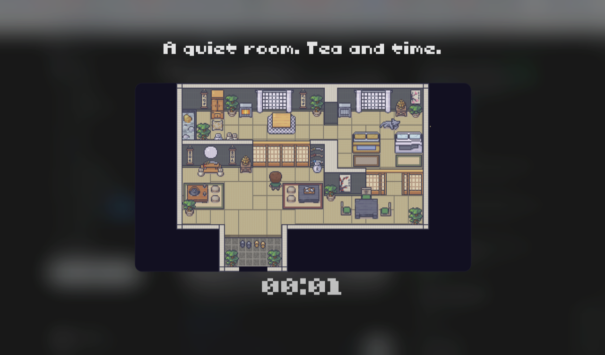

<h1 align="center">DelayNoMore</h1>

<p align="center"><a href="README.zh.md">中文</a></p>

A minimal native macOS break reminder. Runs from the menu bar, counts down a work period, then takes over your screen with a looping video or picture reminder for the entire break.

https://github.com/user-attachments/assets/e08c8b13-a64f-46c5-8c95-612b0cc67c02

<p align="center"><i>Demo: when the work timer ends, a calming video/picture takes over the wholescreen for the entire break.</i></p>

<p align="center"></p>

<p align="center"><i>Picture mode: any still image becomes the break view, with the countdown overlaid.</i></p>

## Why DelayNoMore

- **Native and lightweight** — built in Swift. ~11 MB on disk and ~40 MB of memory at runtime.
- **Video takeover, not a black screen** — It plays a calming video that makes you *want* to take a break.
- **Works out of the box** — several built-in video reminders included. No setup, no configuration required.
- **Bring your own** — drop in any image or video as your reminder. Personal media often pulls you out of work better than stock clips.
- **Simple on purpose** — one job, done well. No micro-breaks, no stats dashboards, no notification spam.

## Install

Download the latest `DelayNoMore.zip` from [Releases](https://github.com/DRunkPiano114/delaynomore/releases), unzip, and drag `DelayNoMore.app` to your Applications folder.

The app is signed with an Apple Developer ID and notarized by Apple, so it opens like any other Mac app — no Terminal commands required. Once installed, DelayNoMore checks for new versions automatically and updates in place.

## Features

- Menu bar app with work/break countdown timer
- 6 built-in video reminders (cats, fireplace, rain, and more)
- Custom image or video reminders
- Hover-to-preview videos in settings
- Configurable work and break durations, with optional auto-repeat
- Automatic in-app updates

## Build from source

Requires macOS 13+ and Swift 5.9+.

```bash
./scripts/build-app.sh
open .build/app/DelayNoMore.app
```

## Development


| Command                  | What it does                                            |
| ------------------------ | ------------------------------------------------------- |
| `swift test`             | Run unit tests                                          |
| `./scripts/dev.sh`       | Kill any running instance, rebuild, and launch the .app |
| `./scripts/check.sh`     | Tests + .app bundle structure check (run before commit) |
| `./scripts/build-app.sh` | Just build the .app bundle                              |


## License

[MIT](LICENSE)